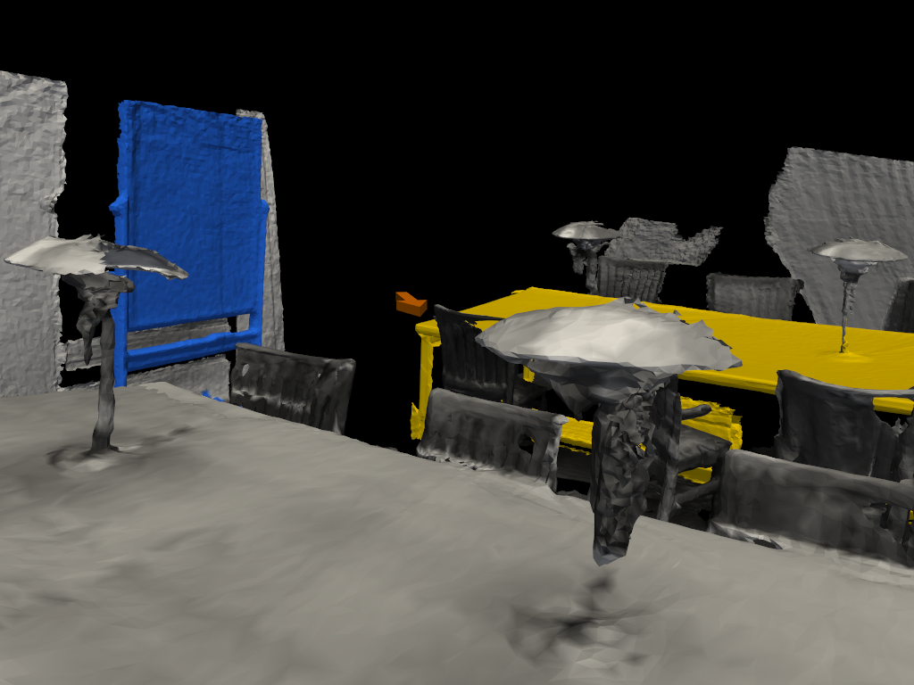
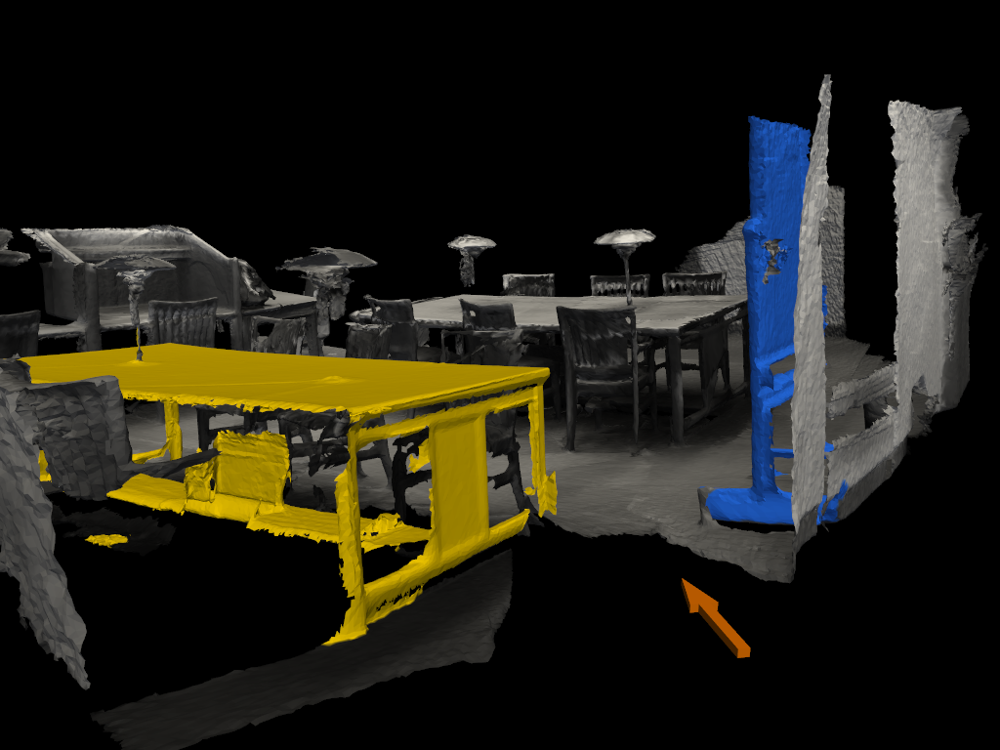
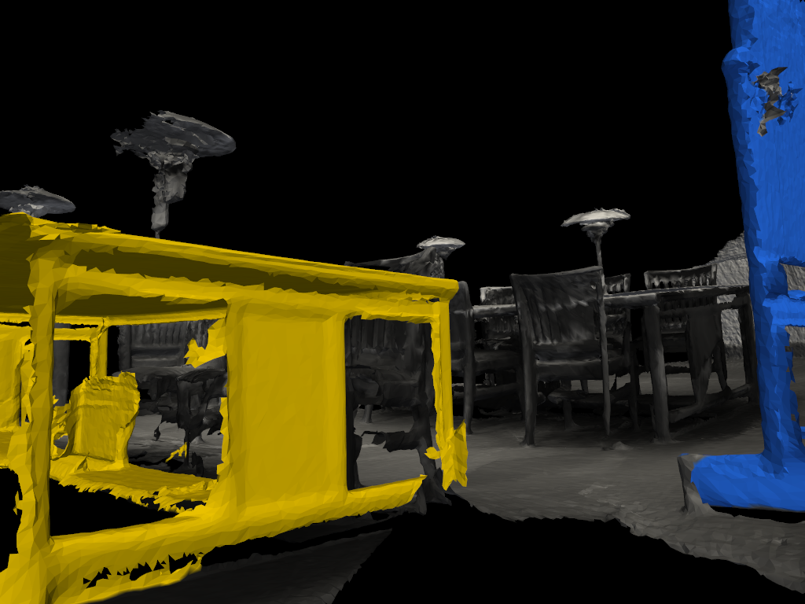
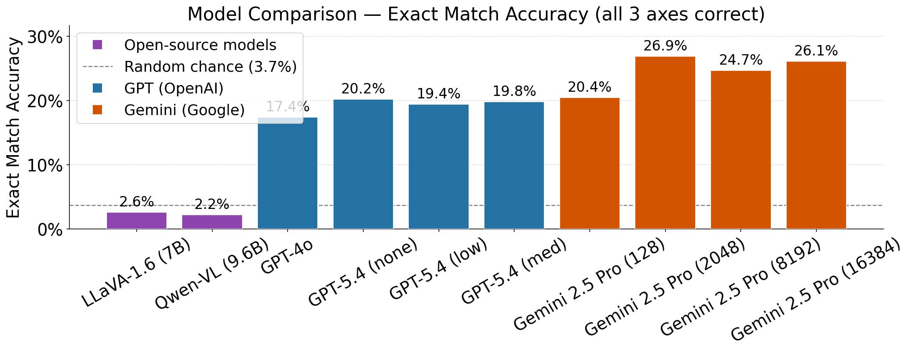
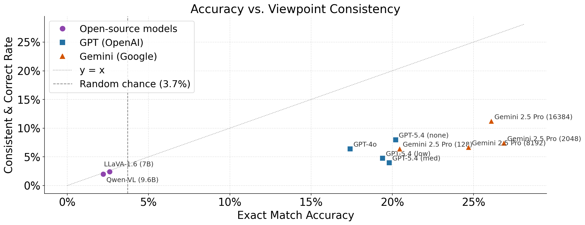
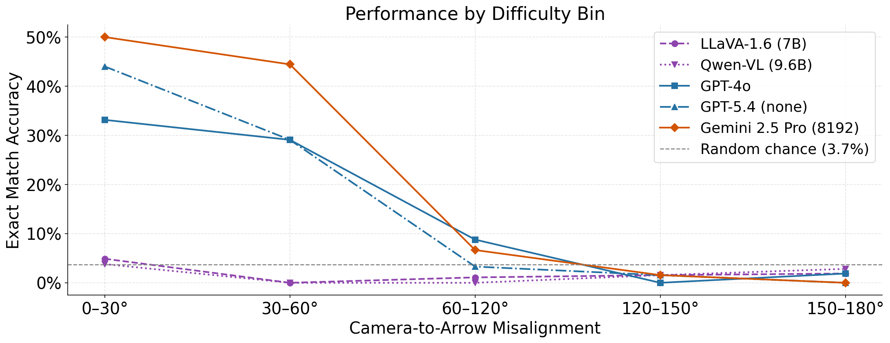
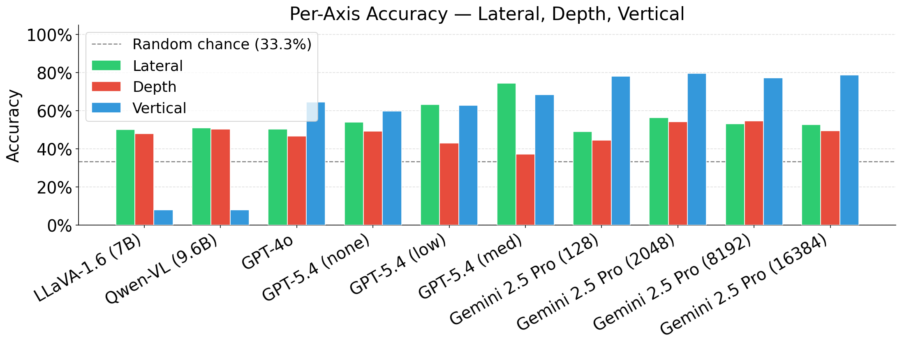
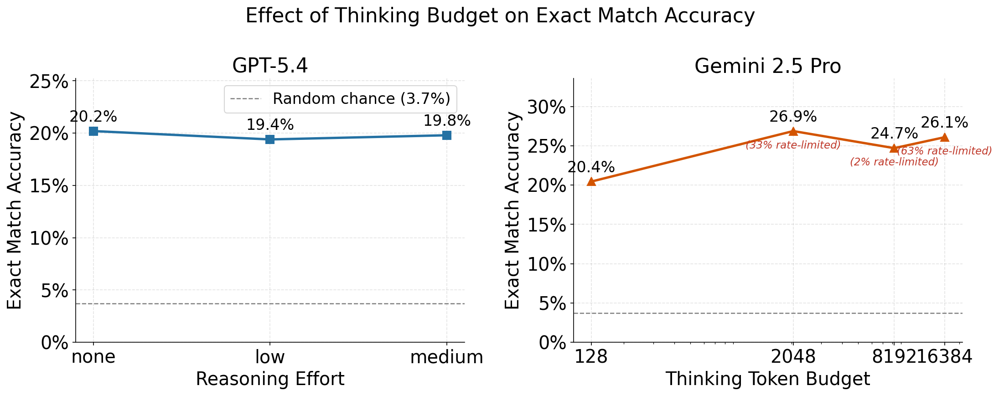

# multiview-invariance

A benchmark for evaluating **spatial reasoning** and **cross-viewpoint invariance** in vision-language models (VLMs), using reconstructed 3D scenes from ScanNet.

The core capability being tested is *mental viewpoint shifting*: can a model look at a scene from one camera angle, imagine standing somewhere else inside that scene, and correctly reason about how the spatial relations between objects change from that imagined perspective?

Each benchmark query renders a 3D scene from a fixed camera position. Two objects in the scene are color-highlighted, and a colored arrow is overlaid — placed at a physically valid position in the scene and pointing toward the midpoint between the two objects. The model must imagine standing at the arrow's position, looking in its direction, and predict the spatial relations between the two objects from that perspective (e.g. "is A to the left or right of B?", "is A in front of or behind B?"). Ground truth is computed analytically from the arrow's camera pose.

Each object pair is rendered from two different camera positions. Because both viewpoints share the same arrow and therefore the same ground truth, we can measure two things independently: (1) whether the model's predictions are **accurate**, and (2) whether they are **consistent across viewpoints** — i.e. whether the model gives the same answer regardless of which camera angle it sees the scene from. A model that reasons correctly about 3D space should be invariant to the camera angle of the rendered image.

---

## Poster


---

## Example data

Each benchmark query consists of a scene image with two color-highlighted objects and a colored arrow indicating the imagined viewpoint. The model receives one of the two camera views (view\_0 or view\_1) and must predict the spatial relations of object A relative to object B as seen from the arrow's position. Both views share the same arrow and therefore the same ground truth, enabling cross-viewpoint consistency measurement.

Below is one example pair (scene0155\_00, magenta table vs. teal whiteboard, yellow arrow):

| View 0 (camera–arrow yaw: −170°) | View 1 (camera–arrow yaw: +10°) | Arrow viewpoint (ground truth) |
|:---:|:---:|:---:|
|  |  |  |

The arrow-viewpoint image (right) shows what the scene looks like from the imagined perspective. Ground truth is derived analytically from the arrow's camera pose — the model never sees this image.

**Example prompt** (sent with view\_0 or view\_1):

```
You are standing at the yellow arrow in this image, looking in the direction it points.

From that perspective, judge the spatial relations of the magenta object (table) relative
to the teal object (whiteboard).

For each axis, choose exactly one value from the options shown.

Output ONLY the JSON object below. Replace each option list with your chosen value
(a quoted string). Do not write anything before or after the JSON object.

{
  "lateral_relation": "left" or "right" or "neither",
  "depth_relation": "in_front" or "behind" or "neither",
  "vertical_relation": "above" or "below" or "neither"
}
```

**Ground truth** (from arrow pose): `lateral=left`, `depth=behind`, `vertical=below`

**GPT-4o responses on this pair:**

| | View 0 (extreme misalignment, −170°) | View 1 (aligned, +10°) |
|---|---|---|
| Raw output | `{"lateral_relation":"right","depth_relation":"behind","vertical_relation":"neither"}` | `{"lateral_relation":"left","depth_relation":"in_front","vertical_relation":"below"}` |
| Lateral | ❌ right (GT: left) | ✅ left |
| Depth | ✅ behind | ❌ in\_front (GT: behind) |
| Vertical | ❌ neither (GT: below) | ✅ below |

The model's answers flip between viewpoints — it gives different predictions for the same object pair and the same arrow, depending on which camera angle it sees the scene from. This is the central failure mode the benchmark is designed to measure.

---

## Results

Three models were evaluated: GPT-4o (2 500 queries), LLaVA-1.6-Mistral-7B and Qwen-VL-Chat (500 queries each). Figures below are from the `readme_files/results/` folder.

### Overall accuracy and consistency





**Per-axis accuracy** (fraction of queries with correct prediction on that axis):

| Model | n | Lateral | Depth | Vertical | Exact match (all axes) |
|---|---|---|---|---|---|
| GPT-4o | 2 500 | 46.8% | 45.4% | 62.0% | 14.8% |
| LLaVA-1.6 | 500 | 50.2% | 48.0% | 8.0% | 2.6% |
| Qwen-VL | 500 | 51.0% | 50.4% | 8.0% | 2.2% |

**Viewpoint consistency** (measured per object pair across its two camera views):

| Model | Consistent | Consistent + correct | Consistent + wrong | Inconsistent |
|---|---|---|---|---|
| GPT-4o | 11.6% | 2.7% | 8.9% | 88.4% |
| LLaVA-1.6 | 84.0% | 2.4% | 81.6% | 16.0% |
| Qwen-VL | 86.4% | 2.0% | 84.4% | 13.6% |

LLaVA and Qwen are highly consistent — but almost always consistently wrong. They appear to collapse to a fixed output regardless of the scene. GPT-4o is more sensitive to scene content but still fails to reason correctly about the imagined viewpoint, and its predictions vary wildly between camera angles.

### Accuracy vs. camera–arrow misalignment

The benchmark bins queries by the yaw angle between the rendering camera and the arrow (i.e., how far the camera is from "looking the same direction as the arrow"). This measures how difficult the imagined perspective shift is.



**GPT-4o accuracy by difficulty bin:**

| Bin | Camera–arrow yaw | n | Lateral | Depth | Vertical | Exact match |
|---|---|---|---|---|---|---|
| Aligned | 0°–30° | 854 | 83.6% | 55.4% | 67.7% | 30.6% |
| Slight | 30°–60° | 262 | 74.4% | 55.3% | 58.0% | 20.2% |
| Moderate | 60°–120° | 529 | 28.7% | 39.3% | 50.9% | 5.1% |
| Strong | 120°–150° | 363 | 19.3% | 39.9% | 58.7% | 5.0% |
| Extreme | 150°–180° | 492 | **8.1%** | 33.5% | 68.9% | 2.2% |

Lateral accuracy collapses from **83.6%** when the camera faces roughly the same direction as the arrow to **8.1%** when it faces the opposite direction — below random chance. Depth follows a similar but shallower trend. Vertical is largely unaffected because it depends on the world up-axis, not yaw orientation.

### Per-axis breakdown and thinking budget





---

## Quick start

### Install dependencies

**Dataset generation** (`generate_viewpoint_pairs.py`, `download_scenes.py`):
```bash
python download_scenes.py --scenes 0
python generate_viewpoint_pairs.py --reference-object --print-reference-image --scene_dir scannet_data/scene0000_00
```

---


## Setup

### Requirements

```
pip install open3d numpy Pillow pyvista huggingface_hub openai
```

**Benchmark — API models** (`chatgpt`, `gemini`):
| Package | Purpose |
|---|---|
| `open3d` | Mesh loading, raycasting (occlusion checks) |
| `numpy` | All geometry math |
| `Pillow` | Saving rendered images |
| `pyvista` | Headless rendering (Windows-compatible via VTK) |
| `huggingface_hub` | Downloading ScanNet scenes |
| `openai` | Sending multimodal prompts (text + images) to ChatGPT/OpenAI models |

> **Windows note:** Open3D's built-in `OffscreenRenderer` requires EGL (Linux only). This repo uses PyVista instead, which works headlessly on Windows via VTK software rendering.

---

## ChatGPT / OpenAI API

The repo includes a small standalone multimodal client in `chatgpt_api.py` for
ad-hoc use. It sends a text prompt plus one or more images to the OpenAI
Responses API and returns the model's text reply.

Set your API key first:

```powershell
$env:OPENAI_API_KEY="your_api_key_here"
```

Example:

```bash
python chatgpt_api.py \
  --prompt "Describe the spatial relation between the highlighted objects in these views." \
  --images outputs/scene0000_00/images/objA_3_objB_7_view_0.png \
           outputs/scene0000_00/images/objA_3_objB_7_view_1.png
```

For dataset-driven evaluation, use `benchmark.py --model chatgpt`. This uses
the OpenAI Responses API with server-side structured output enforcement
(`json_schema` for enum format) and records per-query latency and cost
estimates in `metrics.json`.

---

## Data

Scene data is downloaded from the `zahidpichen/scannet-dataset` Hugging Face dataset and stored under `scannet_data/`.

Each scene directory (e.g. `scannet_data/scene0000_00/`) contains:

| File | Contents |
|---|---|
| `scene0000_00_vh_clean_2.ply` | Reconstructed mesh with per-vertex RGB colors |
| `scene0000_00_vh_clean_2.labels.ply` | Same mesh with per-vertex semantic label IDs |
| `scene0000_00_vh_clean_2.0.010000.segs.json` | Maps each vertex index → segment ID |
| `scene0000_00.aggregation.json` | Maps object instances → segment lists + labels |
| `scene0000_00.txt` | Scene metadata including axis alignment matrix |

---

## Scripts

### 1. `download_scenes.py` — Download ScanNet scenes

Download specific scenes by ID, a contiguous range, or all scenes. `--scenes`, `--upto`, and `--from` are mutually exclusive.

```bash
pip install numpy Pillow tqdm openai google-generativeai
```

**Benchmark — local models** (`llava`, `qwen`):

Install PyTorch first. For NVIDIA GPUs (recommended via conda):
```bash
conda install pytorch torchvision pytorch-cuda=12.4 -c pytorch -c nvidia
```
Then install the remaining packages:
```bash
pip install numpy Pillow tqdm "transformers==4.40.2" "accelerate==0.30.0" bitsandbytes tiktoken einops transformers_stream_generator
```

> `bitsandbytes` enables 4-bit quantization, which is required to run LLaVA or Qwen within typical GPU VRAM budgets. On Windows, use `pip install bitsandbytes --upgrade` to ensure you have v0.43+ (earlier versions had no Windows support).

### Run the benchmark

```bash
# API models
python benchmark.py --model chatgpt --api_key sk-...
python benchmark.py --model gemini  --api_key AI...

# Local models (no API key needed)
python benchmark.py --model llava
python benchmark.py --model qwen

# Use boolean prompt format (enum is the default; boolean uses true/false fields)
python benchmark.py --model qwen --prompt_format boolean

# Restrict to specific spatial axes or a smaller sample
python benchmark.py --model chatgpt --api_key sk-... --axes 0 1 --n_viewpoints 100

# ChatGPT with reasoning and custom image detail
python benchmark.py --model chatgpt --api_key sk-... --reasoning_effort medium --detail high
```

---

## Benchmark script

### Models

| `--model` | Backend | Default version |
|---|---|---|
| `chatgpt` | OpenAI API | `gpt-4o` |
| `gemini` | Google Generative AI API | `gemini-1.5-flash` |
| `llava` | Local via `transformers` | `llava-hf/llava-v1.6-mistral-7b-hf` |
| `qwen` | Local via `transformers` | `Qwen/Qwen-VL-Chat` |

Override the version with `--model_id`, e.g. `--model_id gpt-4o-mini`.

### Arguments

| Argument | Default | Description |
|---|---|---|
| `--model` | *(required)* | Model to benchmark |
| `--api_key` | — | Required for `chatgpt` and `gemini` |
| `--model_id` | auto | Override the default model version |
| `--n_viewpoints` | `500` | Total queries. Must be even; rounded down automatically if odd |
| `--axes` | `0 1 2` | Axes to evaluate: `0` = lateral (left/right), `1` = depth (front/behind), `2` = vertical (above/below) |
| `--prompt_format` | `enum` | `enum` (default): one exclusive string choice per axis (`left`/`right`/`neither` etc.); `boolean`: true/false for each direction. For `chatgpt`, enum enables strict server-side `json_schema` enforcement. |
| `--reasoning_effort` | `none` | ChatGPT only. Reasoning effort for o-series / reasoning-capable models: `none`, `low`, `medium`, `high`, `xhigh`. |
| `--max_output_tokens` | — | ChatGPT only. Cap on generated output tokens. |
| `--detail` | `auto` | ChatGPT only. Image detail level: `auto`, `low`, `high`, `original`. |
| `--dataset_dir` | `dataset` | Dataset index directory |
| `--output_dir` | `results` | Root directory for outputs |
| `--seed` | `42` | Random seed for group shuffling |

### How it works

Each query selects a group (one object pair) and a viewpoint image (`view_N.png`). The image already has the colored arrow overlaid. The model is prompted to imagine standing at the arrow and predict the spatial relations as a JSON object with boolean fields. Ground truth is the arrow-viewpoint spatial relations recorded in the dataset index.

`--n_viewpoints` is divided by 2 to get the number of groups, so each group always contributes both its viewpoints (both viewpoints share the same ground truth, enabling consistency measurement).

### Outputs

Results are written to `results/<model>_<timestamp>/`:

| File | Contents |
|---|---|
| `config.json` | Run configuration |
| `predictions.jsonl` | Per-query: example id, ground truth, prediction, parse error, difficulty bin, latency, usage, cost |
| `metrics.json` | All computed metrics, plus `run_stats` (latency and cost aggregates for chatgpt) |

Predictions stream to disk as they arrive, so a partial run is not lost if interrupted.

### Metrics

**Structural**
- `parse_error_rate` — fraction of responses with no extractable JSON
- `invalid_rate` — fraction of parsed responses that are structurally invalid (both directions true on any axis, or all values false)

**Per-axis** (lateral / depth / vertical; computed on clean predictions)
- `accuracy` — fraction matching ground truth
- `macro_f1` — macro-averaged F1 over 3 classes: `positive` / `negative` / `neither`

**Joint** (over clean predictions)
- `exact_match_accuracy` — all active axes correct simultaneously
- `partial_correctness` — count and fraction for every combination of which axes were correct

**Viewpoint consistency** (cross-viewpoint, per group)
- `consistent_rate` — fraction of groups where the model gives identical predictions on both viewpoints
- `consistent_correct_rate` — consistent and correct
- `consistent_wrong_rate` — consistent but wrong (systematic bias)
- `inconsistent_rate` — prediction flips between viewpoints
- `per_axis` — per-axis consistency and flip rates

**Diagnostic**
- `confusion_matrices` — per axis; rows = ground truth `{positive, negative, neither}`, columns = predicted `{positive, negative, neither, invalid}`
- `directional_bias` — per-direction true-rate in dataset ground truth vs. model predictions

**Run stats** (`run_stats` key; ChatGPT only for cost fields)
- `total_latency_seconds`, `avg_latency_seconds` — wall-clock query time
- `total_estimated_cost_usd` — approximate cost based on published token pricing
- `total_input_tokens`, `total_output_tokens`, `total_cached_input_tokens` — token counts

**Difficulty bins** — all of the above repeated within five bins defined by `|yaw_to_arrow|` (camera-to-arrow misalignment):

| Bin | Range |
|---|---|
| `aligned` | 0° – 30° |
| `slight` | 30° – 60° |
| `moderate` | 60° – 120° |
| `strong` | 120° – 150° |
| `extreme` | 150° – 180° |

---

## Dataset

The dataset index lives in `dataset/` and is produced by `build_dataset_index.py`. It contains three JSONL files:

```
dataset/
    scenes.jsonl    — one record per scene
    groups.jsonl    — one record per object pair
    examples.jsonl  — one record per viewpoint image
```

Key fields used by the benchmark:

| File | Field | Description |
|---|---|---|
| `groups.jsonl` | `object_A`, `object_B` | Instance id, semantic label, highlight color |
| `groups.jsonl` | `reference_object_arrow` | Arrow color and `spatial_relations_from_arrow` (ground truth) |
| `examples.jsonl` | `image_path` | Project-root-relative path to the PNG |
| `examples.jsonl` | `yaw_to_arrow` | Camera-to-arrow yaw misalignment (used for difficulty binning) |

The `dataset.py` module provides a Python loader with group-level shuffling and scene-level train/test splitting.

---

## Building the dataset from scratch

If you need to regenerate or extend the dataset:

### 1. Download scenes

```bash
python download_scenes.py --scenes 0 1 2   # specific scenes
python download_scenes.py --upto 10        # first N scenes
python download_scenes.py --from 210       # scene 210 onwards
python download_scenes.py                  # all scenes
```

Scene data is downloaded from `zahidpichen/scannet-dataset` on Hugging Face and stored under `scannet_data/`.

### 2. Generate viewpoint pairs

```bash
# Single scene
python generate_viewpoint_pairs.py \
    --scene_dir scannet_data/scene0000_00

# Batch (all scenes, skip already-processed)
python generate_viewpoint_pairs.py \
    --scene_dir scannet_data --batch \
    --skip_existing --first_variant_only
```

Key arguments:

| Argument | Default | Description |
|---|---|---|
| `--scene_dir` | *(required)* | Scene dir or root dir (with `--batch`) |
| `--output_dir` | `outputs` | Root directory for rendered images and metadata |
| `--batch` | off | Process all `scene*` subdirs |
| `--skip_existing` | off | Skip scenes whose output dir already exists |
| `--first_variant_only` | off | Only process `sceneXXXX_00`, skip `_01`, `_02`, etc. |
| `--no-reference-object` | — | Disable the colored arrow (arrow is placed by default) |
| `--no-print-reference-image` | — | Disable rendering the arrow-viewpoint image (rendered by default) |
| `--full-colour` | off | Render in original scene colours without highlighting or grayscale |
| `--resolution_w` | `1024` | Output image width in pixels |
| `--resolution_h` | `768` | Output image height in pixels |
| `--fov` | `60.0` | Camera field of view in degrees |
| `--camera_height` | `1.5` | Camera height above floor in metres |
| `--max_pairs_per_scene` | `6` | Cap on pairs saved per scene |
| `--min_object_volume` | `0.2` | Minimum object volume in m³ |
| `--min_centroid_distance` | `0.5` | Minimum distance between object centroids in metres |
| `--max_centroid_distance` | `5.0` | Maximum distance between object centroids in metres |
| `--standoff_distance_factor` | `1.5` | Viewpoint standoff as a multiple of centroid distance |
| `--standoff_min` | `1.0` | Minimum standoff distance in metres |
| `--standoff_max` | `4.0` | Maximum standoff distance in metres |
| `--min_projected_size` | `50` | Minimum object 2D bounding-box side length in pixels |
| `--occlusion_ray_threshold` | `0.5` | Fraction of rays that must reach an object (occlusion check) |
| `--max-arrow-occlusion` | `0.8` | Fraction of rays that must reach the arrow unblocked |
| `--near_geom_dist` | `0.3` | Camera collision threshold in metres |
| `--skip_labels` | — | Space-separated object labels to exclude |
| `--verbose_output` | off | Include all technical fields in metadata JSON |
| `--seed` | `42` | Random seed |

> **Windows note:** Open3D's `OffscreenRenderer` requires EGL (Linux only). This repo uses PyVista instead, which works headlessly on Windows via VTK software rendering.

### 3. Build the index

```bash
python build_dataset_index.py
```

Reads all `outputs/*/metadata.json` files and writes `dataset/`. Re-run any time new scenes are added.

---

## Spatial relation conventions

Relations are computed from the arrow's camera pose and stored in `spatial_relations_from_arrow`. Both members of a complementary pair can be false (neither), but cannot both be true.

| Field | Meaning when `true` |
|---|---|
| `A_left_of_B` | A appears more than 20 px left of B in the image |
| `A_right_of_B` | A appears more than 20 px right of B in the image |
| `A_in_front_of_B` | A is more than 0.1 m closer to the camera than B |
| `A_behind_B` | A is more than 0.1 m farther from the camera than B |
| `A_above_B` | A's centroid and bounding-box bottom are both more than 0.1 m above B's (world up axis) |
| `A_below_B` | A's centroid and bounding-box bottom are both more than 0.1 m below B's (world up axis) |
